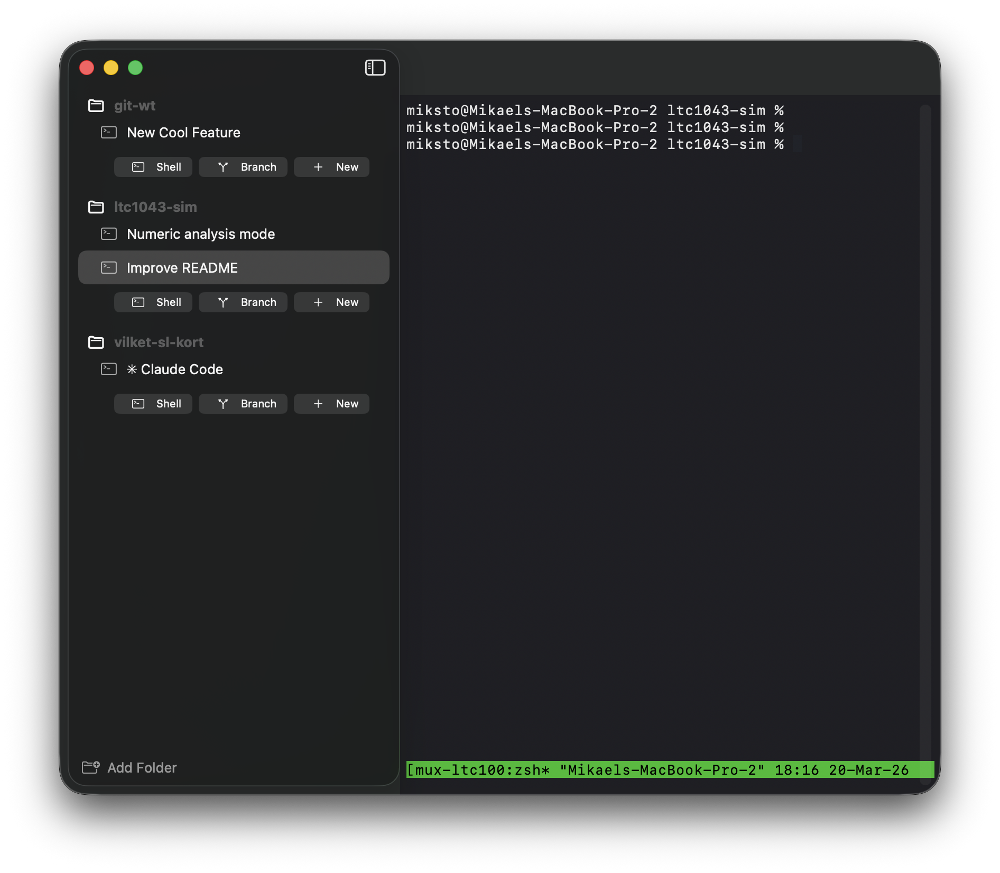

# TermHub

A native macOS app for managing terminal sessions across multiple project folders with automatic git worktree support.



## Features

- **Multi-folder terminal management** — Organize terminal sessions by project folder. Sessions persist automatically across restarts.
- **Git worktree integration** — Create worktrees from existing branches or new ones via a built-in branch picker with fuzzy search. Inline diff viewer and per-session change indicators in the sidebar.
- **Docker sandbox integration** — Run sessions in isolated Docker sandbox containers. Manage sandboxes from a dedicated overlay panel, then pick one when creating a shell or worktree via the split-button menu or `⌥⌘T`. Supports multiple agent types (Claude Code, GitHub Copilot, Codex, Gemini, and more).
- **Tmux-backed sessions** — Each session runs in tmux, so your work survives app restarts.
- **Command palette** — `⌘P` to quickly access actions, sessions, and branches.
- **Embedded terminal** — Full terminal emulator via [SwiftTerm](https://github.com/migueldeicaza/SwiftTerm).
- **Bell notifications** — Sessions that emit BEL show an attention badge in the sidebar.

### Keyboard shortcuts

| Shortcut | Action |
|----------|--------|
| ⌘P | Command Palette |
| ⌘T | New Shell in Current Folder |
| ⌥⌘T | New Sandboxed Shell |
| ⌘N | New Worktree |
| ⌘O | Add Folder |
| ⌘B | Switch Branch / Worktree |
| ⌘W | Close Session |
| ⌘1–9 | Switch to Session 1–9 |
| ⌥⌘↑/↓ | Previous / Next Session |
| ⌘J | Jump to Notification |
| ⌘D | Toggle Git Diff |
| ⌥⌘←/→ | Previous / Next Detail Tab |
| ⌃Tab | Switch Session (MRU) |
| ⌃⇧Tab | Switch Session (MRU, reverse) |
| ⌘/ | Keyboard Shortcuts |

#### Option key modifiers

| Modifier | Action |
|----------|--------|
| Hold ⌥ | Show sandbox indicators on sidebar buttons |
| ⌥ + click shell button | Create sandboxed shell (picks sandbox automatically if only one exists) |
| ⌥ + create worktree | Create new worktree as sandboxed |

### Docker sandboxes

TermHub can run terminal sessions inside isolated Docker sandbox containers. This is useful for running AI coding agents in a sandboxed environment.

**Setting up a sandbox:**

1. Click the **shipping box icon** in the toolbar to open the sandbox manager
2. Create a sandbox by giving it a name, selecting an agent type, and mapping one or more project folders
3. The sandbox appears in the manager with controls to start, stop, and remove it

**Running sessions in a sandbox:**

- Click the **chevron** on the shell split-button in the sidebar to pick a sandbox for the new session
- Hold `⌥` when clicking the shell button to create a sandboxed session directly (if only one sandbox exists, it is selected automatically; otherwise a picker appears)
- Use `⌥⌘T` to create a new sandboxed shell in the current folder (shows a picker when multiple sandboxes exist)
- Sandboxed sessions show "Terminal (Sandboxed)" in the tab bar

**Supported agents:** Claude Code, GitHub Copilot, Codex, Gemini, Docker Agent, Kiro, OpenCode, and Shell.

### Claude Code integration

#### Bell notifications

To get notified in TermHub when [Claude Code](https://claude.com/claude-code) finishes, add this hook to `~/.claude/settings.json`:

```json
{
  "hooks": {
    "Stop": [
      {
        "matcher": "",
        "hooks": [{ "type": "command", "command": "printf '\\a' > /dev/tty" }]
      }
    ]
  }
}
```

The `> /dev/tty` is required so the BEL reaches the terminal rather than being captured by Claude Code's stdout.

#### URL scheme

TermHub registers the `termhub://` URL scheme for creating worktree sessions externally:

```
termhub://new-worktree?repo=/path/to/repo&branch=feature/xyz&plan=/path/to/plan.md&sandbox=my-sandbox
```

| Parameter | Required | Description |
|-----------|----------|-------------|
| `repo` | Yes | Absolute path to the git repository |
| `branch` | Yes | Branch name for the worktree |
| `plan` | No | Path to a plan file — if provided, runs `claude` to implement it in the new session |
| `sandbox` | No | Docker sandbox name — if provided, the new session runs inside the named sandbox |

#### Implement in worktree

When planning a feature with Claude Code on the main branch, you may want the implementation to happen in a separate git worktree. The `/implement-in-worktree` slash command bridges that gap:

```
/implement-in-worktree my-feature-branch
```

This uses the plan file from the current conversation, creates a new worktree and TermHub session for the given branch, and starts Claude with the plan — so you go from planning to isolated implementation in one step.

## Requirements

- macOS 14.0 (Sonoma) or later
- [tmux](https://github.com/tmux/tmux) (recommended, for session persistence)
- [Docker Desktop](https://www.docker.com/products/docker-desktop/) (optional, for sandbox support)

## Building

The project uses [XcodeGen](https://github.com/yonaskolb/XcodeGen) to generate the Xcode project.

```bash
brew install xcodegen tmux
make generate   # generate Xcode project from project.yml
make build      # build the app
make run        # build and launch the app
make test       # run the test suite
```

Or open in Xcode directly:

```bash
xcodegen generate
open TermHub.xcodeproj
```

## Claude Code

When working with [Claude Code](https://claude.com/claude-code), you can use the following slash commands:

- `/build` — Build the app and show only warnings, errors, and the result
- `/run` — Build the app and launch it
- `/test` — Run the test suite and show only test results
- `/regenerate-project` — Regenerate the Xcode project from `project.yml` and refresh the LSP config
